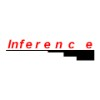

# Pete Butland BSc (Hons)
[LinkedIn](https://www.linkedin.com/in/pete-butland-1909a176)

---

## Personal Information

- **Date of Birth:** May, 1973
- **Nationality:** English
- **Driving License:** Full (UK + AUS)
- **Residential Status:** English/Australian dual-citizenship

---

## Education

###  University of Portsmouth
**September 1991 - September 1994**  
Portsmouth, Hampshire, ENGLAND  
**BSc. (Honours) Degree in Computer Science**
- Final year courses: Object-Oriented Methods, Windows Programming and Application Development, Human Computer Interaction, Computer Graphics
- Programming experience: C, C++, Visual Basic, Smalltalk, macro development (DOS & MS Windows)
- Final year project: "The automation of a regression test facility"

###  Horndean Community College - Sixth Form
**September 1989 - September 1991**  
Horndean, Portsmouth, Hampshire, ENGLAND
- 3 'A' Levels: Physics, Pure Mathematics, Applied Mathematics

### Horndean Community College
**September 1987 - September 1989**  
Horndean, Portsmouth, Hampshire, ENGLAND
- 9 GCSEs: Mathematics, Physics, Chemistry, English Literature, English, Music, Design, French, German

---

## Interests

Music, Reading, Walking, Cryptic crosswords, Sailing, Unicycling, and Juggling.

---

## Referees

Available upon request.

---

## Overview

I am an experienced software developer with a wide variety of exposure in different aspects of software development, including requirements analysis, architecture and design, coding, testing, implementation, release and change management, and devops. My main specialities include being able to learn and understand new and complex systems extremely quickly allowing me to “hit the ground running” and become productive in as short a time as possible.

I constantly strive to pay meticulous attention to detail to ensure the correct solution is delivered on time and at the appropriate cost. Failing to understand user requirements is something that I believe is one of the most costly aspects of software development. Therefore, I always try where possible, to ensure that every stakeholder understands what will be developed for any particular part of a system before any development effort has been expended.

I also believe that the tools that a developer uses to provide software solutions (including which programming languages are used) are just that; tools. Programming languages and technologies come and go, so a good software developer should be able to pick up new tools and discard old tools easily where applicable. While it is important to recognise that certain tools are better suited to some problems than others, in my opinion, the main focus for a developer should be in understanding the system that they are developing and fully understanding the user requirements for that system. And to not get overly distracted with the specific technologies that should be used to achieve the end goal.

---

## Skills Summary

- **Languages:** JAVA, NodeJS, Typescript, JavaScript, Groovy, Ansible, C/C++, HTML, Ruby, Python
- **Cloud Technologies:** AWS, Azure
- **AI & LLMs:** GitHub Copilot (GPT-4.1) and Claude 3.7/4 as coding assistants for system design, architecture, development, and testing. Integration with LLMs via APIs. Prompt engineering
- **Databases:** Postgres, Oracle, DynamoDb, MySQL, Neo4J, MongoDB, Cassandra, Microsoft SQL Server, Sybase, SAS, Microsoft Access, IBM DB2
- **Technologies and Frameworks:** Spring, Spring Boot, Spring Data, Spring Security, Hibernate, Docker, Apache Camel, Guice, Angular, React, Ember, Bootstrap, Flyway, Liquibase, XML, JAXB, JDBC, Micro-services, Service Oriented Architecture, Web services (SOAP, RESTful), JSP, jQuery, OSGi (Equinox), Eclipse RCP, AJAX, GWT, Velocity, JUnit, Mockito, EasyMock, NextApp Echo2 (open source AJAX library), Jasper Reports, JNI, RMI, Unicode, UML, Swing, SWT
- **Source Control:** Git/GitHub/Bitbucket, Subversion (SVN), CVS, PVCS
- **Application Servers:** Express, Tomcat, Jetty, Glassfish, WebLogic, WebSphere
- **Development Tools:** VS Code, IntelliJ IDE, Eclipse IDE, Gradle, Maven, Ant, Yarn, NPM, Jenkins, Bamboo, Jira, Cobertura, Crucible, Confluence, Enterprise Architect
- **Testing tools:** JUnit, Jest, Testcafe, Geb, Spock, Enzyme, Sinon, Gatling, Cucumber, JMeter
- **Operating Systems:** Mac OS, Ubuntu, Windows, Sun Solaris, IBM AIX, OS/2, TSO/MVS
- **Third Party Systems:** New Relic, Sumo Logic, AppDynamics, Grafana, Auth0, ActiveVOS, Open LDAP, Active Directory, Sun Access Manager, Sun Identity Manager

---

## Professional Experience

###  Origin Energy (2021–2024) – Software Developer
Melbourne, AU
- Co-led the successful integration of LPG customers into the Origin MyAccount web application, collaborating closely with cross-functional teams to deliver seamless user experiences. Technologies included React, Node.js, Java, AWS, and Salesforce.
- Architected and deployed a scalable Node.js GraphQL backend on AWS ECS Fargate, enabling efficient data access and improved system reliability for customer-facing features.
- Designed and documented OpenAPI-compliant REST APIs to facilitate robust and secure integration with Salesforce, streamlining business processes and data flows between platforms.
- Enhanced multi-CRM support and optimised system performance, resulting in reduced latency and improved customer satisfaction.
- Championed best practices in documentation, automated testing (Jest, Testcafe, Gatling), and CI/CD pipelines using Jenkins, significantly increasing deployment quality and speed.
- Delivered presentations at internal guilds on monitoring, alerting, and performance optimisation, fostering a culture of knowledge sharing and continuous improvement.

###  Woolworths Group (2021) – Software Developer
Remote
- Led the migration of a legacy SAP/Java application to a modern microservices architecture using Java (SpringBoot), Node.js, and React, improving maintainability and scalability.
- Orchestrated the deployment of a Kubernetes cluster in Azure using Terraform and Jenkins, managing the transition from AWS and ensuring high availability and security.
- Analysed and optimised Aurora RDS MySQL performance for high-traffic retail events, implementing tuning strategies that reduced query times and improved system resilience.

###  Origin Energy (2018–2020) – Software Developer
Melbourne, AU
- Delivered a new customer connection system leveraging React, SpringBoot, Postgres, and SAP, enabling streamlined onboarding and improved customer experience.
- Led the design and implementation of AWS cloud infrastructure, CI/CD pipelines, and monitoring solutions, ensuring robust, automated deployments and proactive system health management.
- Managed and executed data migration of customer records from legacy systems using AWS Lambda, ensuring data integrity and minimal business disruption.

###  National Australia Bank (2018) – Software Developer
Melbourne, AU
- Developed a merchant insights analytics platform using Angular, AWS, SpringBoot, DynamoDB, and Postgres, providing actionable business intelligence to stakeholders.
- Designed a flexible plug-in architecture and implemented CI pipelines, enabling rapid feature delivery and integration of new analytics modules.
- Conducted proof-of-concept projects exploring emerging technologies such as machine learning and face recognition, evaluating their potential for future banking solutions.

###  National Australia Bank (2017–2018) – Software Developer
Melbourne, AU
- Developed a regulatory EU trade reporting tool using Spring Boot, Apache Camel, and ActiveMQ, ensuring compliance with evolving financial regulations.
- Introduced modern Java 8 practices, including streams and functional programming, and mentored team members to improve code quality and maintainability.
- Led the design and implementation of robust logging, auditing, and error handling frameworks, enhancing system transparency and reliability.

###  Sensis (2015–2017) – Software Developer
Melbourne, AU
- Built SEM (Search Engine Marketing) product selector and directory publishing tools using Spring, Angular, and AWS, supporting business growth and digital transformation.
- Led the migration of Yellowpages and Whitepages backend systems to AWS, utilising SpringBoot and Neo4J, resulting in improved scalability and reduced operational costs.
- Managed the migration of legacy Whitepages data to Neo4J, ensuring data consistency and enabling advanced search capabilities.
- Directed the migration of GIS mapping systems to AWS and transitioned to open-source mapping data, reducing licensing costs and increasing flexibility.

###  ANZ (2013–2014) – Analyst Programmer
Wellington, NZ
- Developed and maintained the New Zealand internet banking and mobile API layer using J2EE, Spring, Hibernate, and GWT, supporting secure and reliable digital banking services.
- Advocated for and implemented code quality improvements and Agile development practices, contributing to faster delivery cycles and higher team productivity.

###  Bureau of Meteorology (2013) – Software Developer
Melbourne, AU
- Enhanced the National Water Account system with new features and performance improvements using Spring, GWT, MySQL, and BPEL.
- Improved system documentation and championed Agile processes, increasing project transparency and team collaboration.

###  Sensis (Telstra) (2010–2012) – Software Developer
Melbourne, AU
- Maintained and enhanced directory listing adapters and identity management solutions using J2EE and LDAP, ensuring data accuracy and security.
- Developed RESTful web services and a self-service platform, empowering customers to manage their own directory listings and reducing support overhead.

###  Genix Ventures (2006–2010) – Software Developer
Melbourne, AU
- Led the development of a modular web application plugin framework using OSGi, Eclipse RCP, Spring, and Hibernate, enabling rapid delivery of new features and customisations.
- Implemented CI/CD pipelines and Agile methodologies, improving release frequency and team responsiveness to changing requirements.

###  Monash University (2005) – Part-time Design Tutor
Melbourne, AU
- Tutored undergraduate students in object-oriented analysis, design, and UML, helping them develop strong foundational skills in software engineering principles.

###  CogState (2004–2005) – Software Engineer
Melbourne, AU
- Built automated test harnesses and utilities for cognitive diagnostic tools using Java, JUnit, Eclipse, Ant, and XML, improving product reliability and test coverage.

###  Space-Time Research (2000–2004) – Team Lead/Software Engineer
Melbourne, AU
- Led the design and development of the SuperCHANNEL ETL product using C++, Java, JDBC, XML, and various RDBMS technologies, delivering robust data integration solutions to clients.
- Managed a team of engineers and oversaw project delivery, ensuring high-quality outcomes and adherence to timelines.

### MITS (1999–2000) – Consultant
Melbourne, AU
- Designed and implemented SCADA/DMS sub-systems for industrial automation using C++ and COM/DCOM, contributing to improved system reliability and maintainability.

###  Tellabs (1997–1998) – Software Engineer
London, UK
- Developed network management system (NMS) UI libraries and sub-systems for mobile phone networks using C++, OS/2, and Windows NT, supporting critical telecommunications infrastructure.

###  ISSC Australia Ltd. (1996) – Software Engineer
Melbourne, AU
- Developed utilities and support tools for banking systems using C++, DB2, and REXX, enhancing operational efficiency and data processing capabilities.

###  Inference Europe Ltd. (1995) – Software Engineer
London, UK
- Developed and maintained expert systems for enterprise clients using TSO/MVS, OS/2, and C++, delivering tailored solutions for complex business requirements.

###  IBM UK Ltd. (1991–1994) – Sponsored Student
Portsmouth, UK
- Developed DB2-based client/server modules using PL/1 and REXX, supporting business-critical applications for IBM clients.
- Designed and implemented an automated regression test system, improving software quality and reducing manual testing effort.
